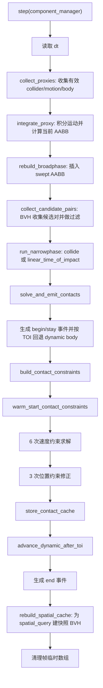

# physics_system 代码说明

本文档说明 `src/game/entity/system/physics_system.ixx` 中的物理系统实现，并补充它依赖的 ECS 组件和物理核心类型语义。

## 模块定位

`physics_system` 是 ECS 层的 2D 刚体碰撞系统。它每帧从 `component_manager` 中收集同时拥有 `collider`、`mech_motion`、`physics_body` 的实体，完成运动积分、碰撞检测、冲量解算、接触事件生成，并维护一个用于外部空间查询的 BVH 缓存。

物理系统负责拥有帧级临时状态，不拥有实体组件本身。系统内部的 `physics_proxy` 只保存组件指针和快照，因此 `step()` 末尾会清空代理和候选对。

## 外部依赖类型

| 类型 | 所在文件 | 作用 |
| --- | --- | --- |
| `mech_motion` | `components/physical_rigid.ixx` | 实体运动状态，包含位置/旋转 `trans`、速度 `vel`、加速度 `accel`，并提供 `vel_at()` 计算接触点速度。 |
| `physics_body` | `components/physical_rigid.ixx` | ECS 包装类型，内部持有 `physics::rigid_body`。提供 `make_static()`、`make_kinematic()`、`make_dynamic()` 工厂函数。 |
| `collider` | `components/physics.ixx` | 碰撞组件，包含 `collision_shape_record`、`collision_filter`、局部变换、启用状态、CCD 配置。 |
| `physics_contact_event` | `components/physics.ixx` | 对外发布的接触事件，包含 begin/stay/end、实体、sensor 标记、TOI、法线、深度、接触点。 |
| `physics_query_result` | `components/physics.ixx` | `spatial_query()` 返回的查询快照，包含 `entity_pin`、AABB、位置、半径。 |
| `physics::rigid_body` | `physics/rigid_body.ixx` | 刚体参数和力/冲量接口，区分 static、kinematic、dynamic。只有 dynamic 会被冲量和力改变。 |
| `physics::collision_filter` | `physics/collision_filter.ixx` | 碰撞过滤规则。`category/mask` 控制通道，`group` 可强制同组碰撞或忽略，`sensor` 表示只触发事件不解算。 |
| `physics::collision_shape_record` | `physics/shape.ixx` | 运行时碰撞形状记录，支持圆、胶囊、盒、凸多边形及复合形状。 |
| `physics::dynamic_bvh<T>` | `physics/dynamic_bvh.ixx` | 动态包围盒树，用于 broadphase 候选对收集和空间查询。 |
| `physics::contact_manifold` | `physics/gjk_epa.ixx` | narrowphase 输出的接触流形，最多 2 个接触点。 |

## physics_system 内部类型

| 类型 | 作用 |
| --- | --- |
| `physics_proxy` | 当前帧参与物理的实体代理。保存实体 id、`collider`/`mech_motion`/`physics_body` 指针、上一帧和当前的运动/形状变换、当前 AABB、swept broadphase AABB、已处理 TOI。 |
| `candidate_pair` | broadphase 生成的候选碰撞对。记录代理索引、是否 sensor、是否需要解算、是否使用 CCD、是否命中、TOI 和接触流形。 |
| `contact_constraint_point` | 单个接触点的约束数据。包含世界接触点、两边相对质心偏移、穿透深度、法线/切线有效质量、累计冲量、速度偏置。 |
| `contact_constraint` | 一个实体对的接触约束。包含两端代理索引、接触 key、法线/切线、初始位置、摩擦系数和最多 2 个接触点。 |
| `cached_contact_point` | 上一帧接触点缓存。保存两边局部接触点和累计法线/切线冲量，用于 warm start。 |
| `contact_cache_entry` | 一个接触对的缓存条目。保存稳定法线和最多 2 个 `cached_contact_point`。 |
| `spatial_entry` | 空间查询缓存条目。保存 `entity_pin`、AABB、位置快照和半径快照。`valid()` 用于过滤已失效实体。 |

## 成员数据

| 成员 | 作用 |
| --- | --- |
| `broadphase_` | 动态 BVH。`step()` 中先用于碰撞 broadphase，末尾重建为查询缓存索引。 |
| `proxies_` | 当前帧物理代理列表。 |
| `candidate_pairs_` | broadphase 候选对和 narrowphase 结果。 |
| `contact_constraints_` | 需要刚体解算的接触约束。sensor 或不可解算对不会进入这里。 |
| `spatial_entries_` | `spatial_query()` 使用的稳定快照。 |
| `contact_events_` | 当前帧对外可读事件。下一次 `step()` 会重建。 |
| `previous_contacts_` | 上一帧仍在接触的 key 集合，用于生成 begin/stay/end。 |
| `current_contacts_` | 当前帧命中的 key 集合。 |
| `contact_cache_` | 上一帧有效约束缓存，用于稳定法线和 warm start。 |
| `next_contact_cache_` | 当前帧写入缓存，帧末与 `contact_cache_` 交换。 |

## 常量

| 常量 | 作用 |
| --- | --- |
| `drag_linear_stop_speed` / `drag_angular_stop_speed` | 阻力衰减后速度低于阈值时直接置零，避免低速抖动。 |
| `restitution_velocity_threshold` | 相对法线速度低于该负阈值时才加入反弹速度偏置。 |
| `contact_cache_match_distance` | warm start 时匹配上一帧接触点的局部距离阈值。 |
| `contact_cache_normal_dot` | 复用缓存冲量前要求当前法线与缓存法线足够接近。 |
| `contact_normal_reuse_dot` | narrowphase 法线与缓存法线接近时直接复用缓存法线，减少静止接触抖动。 |
| `parallel_proxy_threshold` | 代理数量达到阈值后并行积分。 |
| `parallel_pair_threshold` | 候选对数量达到阈值后并行 narrowphase。 |

## 每帧主流程



## 私有函数说明

| 函数 | 作用 |
| --- | --- |
| `to_transform(const mech_motion&)` | 从运动组件取出 `uniform_trans2` 变换。当前实现直接返回 `motion.trans`。 |
| `shape_transform(const collider&, math::trans2)` | 将 collider 的局部变换拼接到实体运动变换上，得到形状世界变换。 |
| `swept_aabb(math::frect, math::vec2)` | 用位移扩展 AABB，得到覆盖前后位置的 broadphase 包围盒。 |
| `integrate_proxy(physics_proxy&, float)` | 对一个代理做运动积分。static 只清空加速度；dynamic 先积分加速度、力和力矩，再推进位姿、施加阻力、清空力；kinematic 只按已有速度推进。最后更新上一帧/当前变换和当前 AABB。 |
| `collect_proxies(component_manager&, float)` | 遍历 ECS chunk，收集实体有效、collider 启用、shape 非空的物理实体，并调用 `integrate_proxy()`。实体数量大时使用 `std::execution::par`。 |
| `rebuild_spatial_cache()` | 清空并重建 `spatial_entries_` 和 `broadphase_`，用于 `step()` 之后的 `spatial_query()`。这里保存快照，不暴露组件指针。 |
| `rebuild_broadphase()` | 用当前帧代理的 swept AABB 重建 BVH，用于碰撞候选对收集。 |
| `candidate_needs_ccd(lhs, rhs)` | 任一 collider/body 配置为 CCD 且速度超过阈值时返回 true。 |
| `candidate_can_solve(lhs, rhs)` | 只要任一刚体是 dynamic 就可解算；两个 static/kinematic 之间不会求解冲量。 |
| `stabilize_contact_normal(lhs, rhs, contact)` | 若本帧法线与上一帧缓存法线足够接近，则复用缓存法线，降低低速面接触抖动。 |
| `collect_candidate_pairs()` | 通过 BVH 收集 swept AABB 重叠对，排除同实体、过滤器不允许碰撞和实际 broadphase AABB 不重叠的对，并标记 sensor、solve、ccd。 |
| `run_narrowphase()` | 对候选对做精确碰撞。CCD 对使用 `linear_time_of_impact()` 并在 TOI 插值位置构建 manifold；非 CCD 对直接在当前变换下 `collide()` 并构建 manifold。候选数量大时并行执行。 |
| `rewind_dynamic_to_toi(physics_proxy&, float)` | 对需要解算的 dynamic body 回退到最早命中的 TOI 位置，避免高速物体已经穿过后再解算。 |
| `advance_dynamic_after_toi(const physics_proxy&, float)` | 解算后把曾回退到 TOI 的 dynamic body 按剩余时间继续推进。 |
| `contact_normal(const physics::contact_result&)` | 归一化 contact 法线，空法线回退到 `(1,0)`。当前文件中未被调用。 |
| `inverse_effective_mass(...)` | 计算某个接触轴上的等效逆质量，包含平动逆质量和转动惯量贡献。 |
| `local_contact_point(proxy, point)` | 把世界接触点转换到实体局部空间，用于缓存匹配。 |
| `apply_velocity_impulse(lhs, rhs, point, impulse)` | 对 lhs 施加反向冲量、rhs 施加正向冲量，修改两边速度。实际是否生效由 `rigid_body::apply_impulse()` 判断 dynamic。 |
| `apply_position_impulse(proxy, impulse, contact_offset)` | 对 dynamic body 直接修正位置和角度，用于位置约束去穿透。 |
| `transfer_cached_impulses(contact_constraint&)` | 从上一帧缓存中匹配当前接触点，转移累计法线/切线冲量，为 warm start 准备初值。 |
| `make_contact_constraint(const candidate_pair&)` | 把 narrowphase 的 manifold 转换为求解器约束。计算法线、切线、摩擦、接触点偏移、法线/切线有效质量和反弹速度偏置，并尝试转移缓存冲量。 |
| `build_contact_constraints()` | 从命中、可解算、且有接触点的候选对生成约束列表。 |
| `warm_start_contact_constraints()` | 把缓存冲量立即应用到速度上，加快稳定接触收敛并改善静摩擦表现。 |
| `solve_velocity_constraint(lhs, rhs, constraint)` | 单个约束的速度求解。先解法线冲量防止继续靠近，再解切线冲量模拟库仑摩擦，并累加 clamp 后的冲量。 |
| `solve_velocity_constraints()` | 遍历所有约束调用 `solve_velocity_constraint()`。当前每帧迭代 6 次。 |
| `solve_position_constraint(lhs, rhs, constraint)` | 单个约束的位置修正。带 `slop`、`percent`、`max_correction`，只修正 dynamic body，减少穿透但避免过度弹开。 |
| `solve_position_constraints()` | 遍历所有约束调用 `solve_position_constraint()`。当前每帧迭代 3 次。 |
| `store_contact_cache()` | 将当前约束的局部接触点和累计冲量写入下一帧缓存。发生 CCD 回退的约束不缓存，避免 TOI 接触污染静态缓存。 |
| `emit_event(pair, phase)` | 根据候选对和接触流形代表点生成 `physics_contact_event`。 |
| `solve_and_emit_contacts(float)` | 接触处理总控。生成 begin/stay 事件，必要时 TOI 回退，构建并迭代求解约束，缓存接触，推进剩余时间，最后根据 `previous_contacts_` 生成 end 事件。 |

## 公有函数说明

| 函数 | 作用 |
| --- | --- |
| `clear()` | 清空 BVH、临时数组、事件集合、接触集合和接触缓存。通常用于世界重置或运行时缓存清理。 |
| `step(component_manager&)` | 物理系统主入口。执行完整一帧物理流程，随后保留 `contact_events_` 和 `spatial_entries_` 供其他系统查询。 |
| `run(component_manager&)` | `step()` 的别名，便于按系统统一接口调用。 |
| `contact_events() const` | 返回当前帧事件只读 span。调用者应在下一次 `step()` 前消费。 |
| `spatial_query(math::frect, Fn&&) const` | 在查询 BVH 中查找与区域重叠的实体快照。回调若返回 `bool`，返回 true 表示提前终止；否则遍历所有命中。 |

## 接触事件语义

`physics_contact_key::ordered(lhs, rhs)` 用稳定顺序表示实体对，因此 begin/stay/end 能跨帧匹配。事件中的 `subject` 和 `object` 当前由候选对 lhs/rhs 给出，不承诺与 key 顺序一致。

`phase` 含义如下：

| phase | 触发条件 |
| --- | --- |
| `begin` | 当前帧命中，上一帧未记录该接触。 |
| `stay` | 当前帧命中，上一帧也记录该接触。 |
| `end` | 上一帧记录接触，当前帧未命中。 |

sensor 对仍会生成 begin/stay/end 事件，但 `solve` 为 false，不进入刚体冲量解算。`projectile_system` 目前会忽略 `end` 和 sensor 事件，只用非 sensor 的 begin/stay 让弹体过期。

## CCD 处理

CCD 由 `collider::wants_ccd()` 决定。它综合 collider 自己的 `ccd` 设置、body 的 `ccd` 设置，以及两者中的较大速度阈值。当前支持的模式是 `physics::ccd_mode::linear_sweep`。

当候选对需要 CCD 时：

1. `run_narrowphase()` 调用 `physics::linear_time_of_impact()`，得到 `[0, 1]` 范围内的 `toi.fraction`。
2. 命中后在 TOI 插值变换下构建 `contact_manifold`。
3. `solve_and_emit_contacts()` 对可解算 dynamic body 回退到最早 TOI。
4. 约束求解完成后，`advance_dynamic_after_toi()` 按剩余 dt 继续推进。

## 过滤和求解规则

候选对必须同时满足：

| 条件 | 说明 |
| --- | --- |
| 不同实体 | `lhs.id == rhs.id` 会被跳过。 |
| 过滤器允许 | `collision_filter::can_collide_with()` 必须为 true。 |
| swept AABB 重叠 | BVH 查询后仍用 `overlap_exclusive()` 做一次确认。 |

是否进入解算还要满足：

| 条件 | 说明 |
| --- | --- |
| 非 sensor | 两边任一 `filter.sensor` 为 true 时只发事件不解算。 |
| `should_solve_with()` | 通道规则允许，且两边都不是 sensor。 |
| 至少一个 dynamic | 两个 static/kinematic 之间不需要冲量解算。 |
| 有 manifold 点 | narrowphase 命中但没有接触点时不构建约束。 |

## 空间查询语义

`spatial_query()` 查询的是上一轮 `step()` 末尾 `rebuild_spatial_cache()` 生成的快照，而不是当前 ECS 组件指针。这样做有两个好处：

1. 组件搬迁后查询仍安全。
2. 已经标记失效或销毁的实体可通过 `entity_pin::is_inserted()` 过滤。

查询结果只包含适合 broadphase/瞄准系统使用的轻量信息：实体 pin、AABB、位置快照、半径快照。如果需要读取实时组件，应由调用者拿到 `id()` 后自行检查实体状态。

## 稳定性策略

该系统针对低速接触和堆叠稳定性做了几处处理：

| 策略 | 作用 |
| --- | --- |
| 阻力低速置零 | 防止速度无限逼近 0 后继续产生微小抖动。 |
| 接触法线缓存复用 | 面接触时避免 GJK/EPA 法线在相近方向间跳变。 |
| warm start | 复用上一帧累计冲量，提高静止接触和摩擦收敛速度。 |
| 位置 slop | 小穿透不修正，减少静止物体被微小误差反复推开。 |
| 迭代解算 | 速度约束 6 次、位置约束 3 次，属于轻量 sequential impulse 求解器。 |

## 与 game_world 的关系

`game_world::run_systems()` 的顺序是：

1. `component_manager.do_deferred()`
2. `motion_system.run(component_manager)`
3. `systems.physics.step(component_manager)`
4. `component_manager.do_deferred()`

`motion_system` 会跳过拥有 `physics_body` 的实体，因此物理实体的运动积分由 `physics_system` 接管，非物理实体仍由普通 motion 系统推进。

## 维护注意点

1. `physics_proxy` 内部保存组件指针，只能在当前 `step()` 内使用。不要把它或其引用泄漏到帧外。
2. `broadphase_` 在同一个 `step()` 中有两种用途：前半段用于碰撞候选对，末尾被重建为 `spatial_query()` 索引。新增逻辑时要注意使用时机。
3. sensor 事件和实体销毁后的 end 事件是测试覆盖的外部契约，修改事件逻辑时应运行 `physics_ecs_test`。
4. `contact_cache_` 依赖 `physics_contact_key` 的稳定排序和局部接触点匹配。修改 manifold 生成或实体局部空间计算时，要同步检查 warm start。
5. 并行 narrowphase 只写各自的 `candidate_pair`，不要在 `solve_pair` 中写共享容器。
6. 代码中存在 `contact_normal()` 工具函数当前未被调用，保留或删除前应确认是否计划用于后续法线归一化逻辑。

## 建议验证命令

```powershell
xmake f -m debug
xmake build physics_core_test
xmake build physics_ecs_test
xmake run physics_core_test
xmake run physics_ecs_test
```

如果是 clean 后第一次构建，按仓库说明先执行：

```powershell
xmake -b xrgui.default
```
